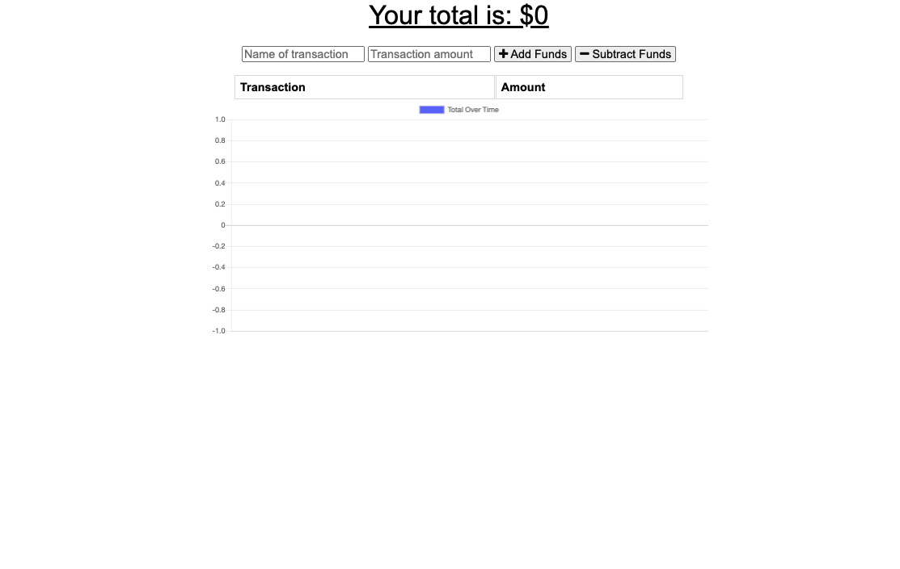
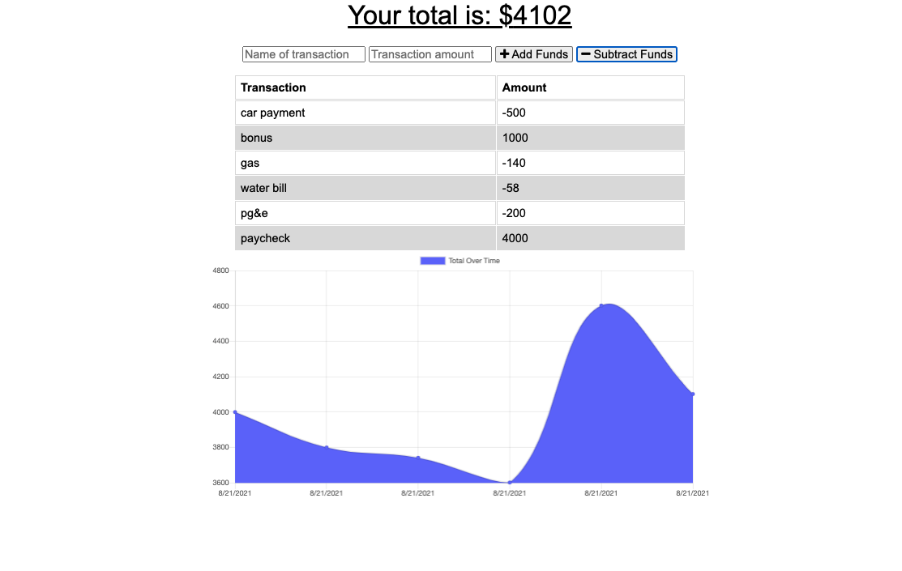

# **Budget Tracker**

  

  ## Description

Budget Tracker ia a application that allow for user to track there budget either online/offline.

  ## Table of Contents
  * [Description](#description)
  * [License](#license)
  * [Deployed Link](#deployed-link)
  * [Questions](#questions)
  * [Sample Image](#sample-image)

  ## Deployed Link

  [Heroku Link](https://mysterious-sea-12822.herokuapp.com/)

  ## License
  [MIT License](https://opensource.org/licenses/MIT)

  ## Questions
  If you have any questions: eycs0317@gmail.com

  [My GitHub](https://github.com/eycs0317)

  ## Sample Image

  
  
